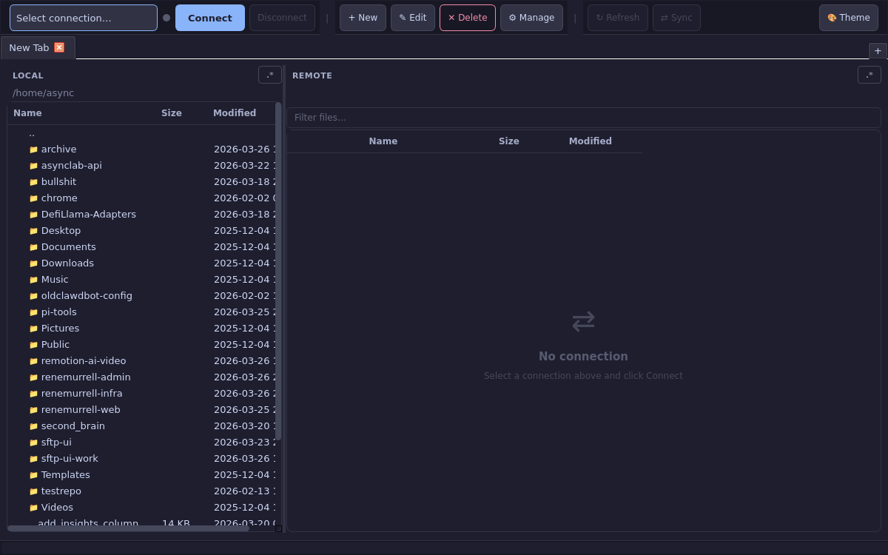
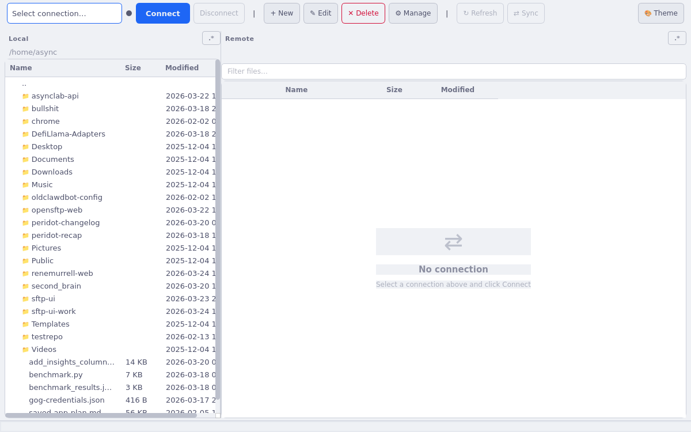
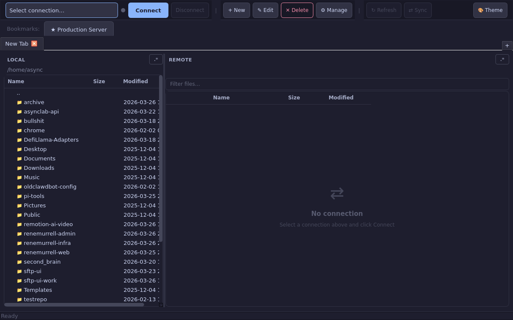
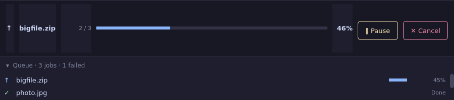
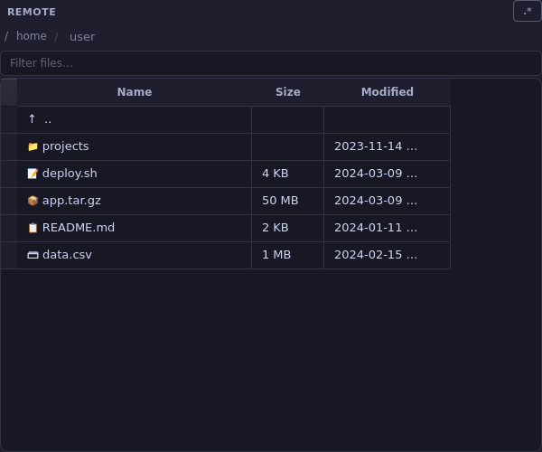

# openSFTP

**A dual-pane SFTP client for macOS, Linux, and Windows.**
Built with Python and PySide6. Native feel. No Electron.

[](https://github.com/mylilcrowdi/opensftp/actions/workflows/ci.yml)
[](https://www.python.org/downloads/)
[](LICENSE)



---

## Screenshots

| Main window (dark) | Light theme | Connection dialog |
|---|---|---|
|  |  |  |

| Transfer panel — active | Transfer panel — paused | Remote panel |
|---|---|---|
|  |  |  |

---

## Features

**File management**
- Dual-pane layout — local filesystem left, remote right
- Drag-and-drop upload — drop files or folders onto the remote panel
- File permissions editor — chmod with checkboxes and octal input
- Remote search — filter by name or glob, results update live
- Bookmarks bar — pin favorite connections as quick-connect chips

**Transfers**
- 4 concurrent workers with auto-retry and exponential back-off
- Pause and resume individual jobs or the entire queue
- Resumable uploads and downloads — picks up after a dropped connection
- Per-file progress with accurate totals pre-calculated before the first byte moves

**Connections**
- SSH key auth (Ed25519, RSA, ECDSA) and password auth
- SSH agent forwarding
- Keepalive interval configurable per connection
- SSH tunnel / jump host support
- Connections stored in `~/.config/sftp-ui/connections.json`
- Passwords optionally stored in the system keychain (macOS Keychain, libsecret, Windows Credential Manager)
- Auto-reconnect on disconnect

**Sync**
- Directory comparison — local only, newer, same, older, remote only
- Selective sync — choose exactly which entries to upload or download
- Conflict detection with configurable mtime tolerance

**Cloud storage**
- Amazon S3, MinIO, Backblaze B2, DigitalOcean Spaces (via `boto3`)
- Google Cloud Storage (via `google-cloud-storage`)
- Same dual-pane UI — no separate workflow

**UI**
- 5 themes: Dark, Light, Nord, Dracula, Solarized Dark — switchable live
- System theme detection (follows macOS / GNOME dark mode automatically)
- Multi-tab connections — open several servers in one window
- Session restore — reopens to the same local and remote paths on every launch
- Keyboard shortcuts overlay (F1 or Ctrl+?)
- Shimmer skeleton while directory listings load

---

## Run from source

The free, MIT-licensed version. Clone and run with Python.

### 1. Clone the repo

```bash
git clone https://github.com/mylilcrowdi/opensftp.git
cd opensftp
```

### 2. Create a virtual environment

```bash
python3 -m venv .venv
```

Activate it:

```bash
# macOS / Linux
source .venv/bin/activate

# Windows (PowerShell)
.venv\Scripts\Activate.ps1

# Windows (Command Prompt)
.venv\Scripts\activate.bat
```

### 3. Install dependencies

```bash
pip install -r requirements.txt
```

Cloud storage (`boto3`, `google-cloud-storage`) is included in `requirements.txt`. Remove those lines if you want a leaner install without S3/GCS support.

### 4. Run

```bash
# macOS / Linux
PYTHONPATH=src python -m sftp_ui.app

# Windows (PowerShell)
$env:PYTHONPATH="src"; python -m sftp_ui.app
```

### Linux: Qt platform dependencies

PySide6 on Linux needs a few system libraries. Install them once:

```bash
# Ubuntu / Debian
sudo apt-get install -y \
  libgl1-mesa-dev libglib2.0-0 libdbus-1-3 \
  libxkbcommon0 libfontconfig1 libegl1 \
  libxcb-xinerama0 libxcb-icccm4 libxcb-image0 \
  libxcb-keysyms1 libxcb-randr0 libxcb-render-util0 \
  libxcb-shape0 libxcb-xfixes0

# Fedora / RHEL
sudo dnf install -y \
  mesa-libGL glib2 dbus-libs \
  libxkbcommon fontconfig libglvnd-egl
```

---

## Build a native executable

[Briefcase](https://briefcase.readthedocs.io/) packages the app into a native installer — `.app` + `.dmg` on macOS, `.AppImage` on Linux, `.msi` on Windows. No Python required on the target machine.

```bash
pip install briefcase
```

**macOS**

```bash
briefcase create macOS
briefcase build macOS
briefcase package macOS    # → dist/*.dmg
```

**Linux**

```bash
briefcase create linux
briefcase build linux
briefcase package linux    # → dist/*.AppImage
```

**Windows**

```bash
briefcase create windows
briefcase build windows
briefcase package windows  # → dist/*.msi
```

---

## Tests

```bash
pip install -r requirements-dev.txt
pytest tests/
```

**1585 tests.** Runs fully headlessly — no display required. Covers every module: transfer engine, queue, SFTP client, connection store, all UI panels, widgets, animations, sync logic, cloud clients, and keyboard shortcuts.

```
tests/
├── test_transfer.py / test_download.py         # upload + download engine, resume, retry
├── test_queue.py / test_queue_extended.py      # concurrent worker pool, cancel
├── test_sftp_client_integration.py             # in-process paramiko server — no Docker
├── test_load_pkey.py                           # SSH key loading: RSA, ECDSA, encrypted
├── test_connection.py / test_connection_dialog.py
├── test_sync_scan.py / test_sync_dialog.py / test_sync_model.py
├── test_remote_panel_ops.py / test_remote_model.py / test_remote_filter.py
├── test_local_panel.py / test_local_panel_ops.py / test_local_panel_keys.py
├── test_feature_drag_drop.py / test_feature_remote_search.py
├── test_feature_auto_reconnect.py / test_feature_tabs.py / test_feature_edit_remote.py
├── test_ssh_agent.py / test_keychain.py / test_tunnel.py
├── test_keepalive_tuning.py / test_permissions_dialog.py / test_bookmarks_bar.py
├── test_theme_manager.py / test_theme_dialog.py
├── test_cloud_client.py / test_cloud_connection_dialog.py
├── test_animated_status_bar.py / test_skeleton_widget.py / test_transitions.py
├── test_ui_state.py / test_ui.py / test_main_window.py
└── test_shortcuts_dialog.py / test_platform_utils.py / test_sort_persistence.py
```

Run a single file during development:

```bash
pytest tests/test_transfer.py -v
```

---

## Project structure

```
src/sftp_ui/
├── app.py             # Entry point — QApplication setup
├── core/              # Zero-Qt business logic
│   ├── sftp_client.py # paramiko wrapper — one connection per operation
│   ├── transfer.py    # Upload engine — chunked, resumable, retry
│   ├── download.py    # Download engine
│   ├── queue.py       # Worker pool — N concurrent jobs, pause/resume/cancel
│   ├── sync.py        # Directory comparison algorithm
│   ├── connection.py  # Connection dataclass + JSON store
│   ├── ui_state.py    # Session persistence (last paths, column widths)
│   └── cloud.py       # S3 / GCS adapter
├── styling/           # Hot-swappable QSS themes
│   ├── dark.qss / light.qss / nord.qss / dracula.qss / solarized_dark.qss
│   └── theme_manager.py
├── animations/        # Named transition presets (fade, slide, pulse)
└── ui/
    ├── main_window.py           # Orchestrator — thread-safe signal bridge
    ├── panels/
    │   ├── local_panel.py       # QTreeWidget — local filesystem
    │   └── remote_panel.py      # QTableView — remote filesystem
    ├── dialogs/
    │   ├── connection_dialog.py  # New/edit connection form
    │   ├── sync_dialog.py        # Sync preview + job builder
    │   ├── permissions_dialog.py # chmod UI
    │   └── shortcuts_dialog.py   # Keyboard shortcut reference (F1)
    └── widgets/
        ├── transfer_panel.py     # Live queue UI
        ├── bookmarks_bar.py      # Quick-connect chips
        ├── status_dot.py         # Connection state indicator
        ├── skeleton_widget.py    # Shimmer loading placeholder
        └── smooth_progress_bar.py
```

`core/` has zero Qt imports — every module is unit-testable without a display.

---

## Architecture

| Decision | Reason |
|---|---|
| PySide6 over PyQt6 | LGPL license — distributable without GPL contamination |
| One paramiko connection per SFTP operation | paramiko is not thread-safe; new connections are cheap |
| Jobs pre-registered before workers start | Accurate batch progress from tick one |
| Two-phase upload (local walk first) | Panel appears in <100 ms; remote round-trips run in background |
| `core/` with zero Qt imports | Business logic is fully unit-testable without a display |
| Briefcase for packaging | Native installers on all three platforms from one codebase |

---

## Contributing

Issues and PRs are welcome.

- Run `pytest tests/ --ignore=tests/test_e2e_screenshots.py -q` before opening a PR
- `core/` must stay Qt-free — no `PySide6` imports
- New features need tests
- CI runs on macOS and Linux (Python 3.11 + 3.12)

---

## License

The source code is MIT licensed — see [LICENSE](LICENSE).

MIT means you can use, modify, and distribute the code freely, including for commercial purposes.
You can build and run openSFTP yourself at no cost.

**Pro build:** A signed, packaged desktop installer (no Python required — just download and run)
is sold separately at [renemurrell.de/software/opensftp](https://renemurrell.de/software/opensftp) for $29 once.
It also includes Pro themes, advanced sync profiles, and priority support.
The Pro build is not open source.
